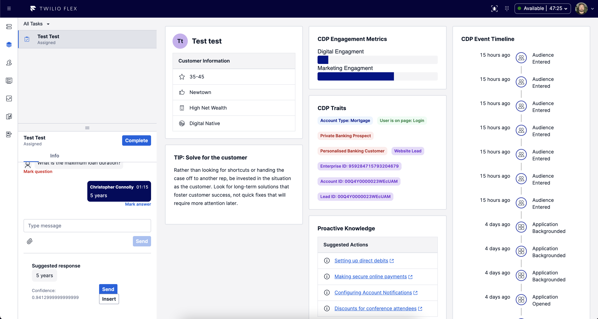

# Twilio Flex + Segment Plugin

🍭 Flex plugin to show Segment data and send handling events to Segment

Events are pulled from the Segment Profile API via a Serverless function and displayed in Panel2 of Flex. Events sent to Segment are proxied through Serverless functions also.

**_Features:_**

- 🌟 Customer event timeline
- 🌟 Display of event name or page title
- 🌟 Hyperlinks for page views
- 🌟 Known Traits are displayed and able to be styled
- 🌟 Agent handling events sent to Segment
- 🌟 Same Serverless API can be used in Studio
- 🌟 Paste theme customisation support

## Deployment

### Segment
Obtain the following from Segment:
1. API Token for accessing Profile API
2. Write key for Flex (configure as a Node.JS source)

# Building

This is a composed of both a Flex Plugin and a Twilio Serverless project, run `yarn` in each of the corresponding project directories to load dependencies. 

See `package.json` for script details on helper methods

# Credits
J. Learmouth & C.Connolly
